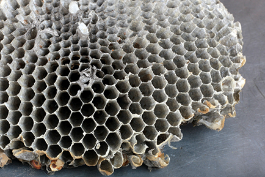
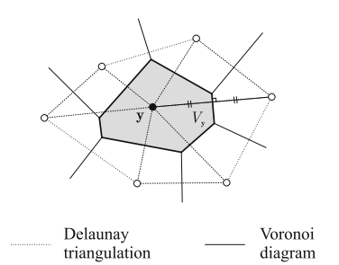
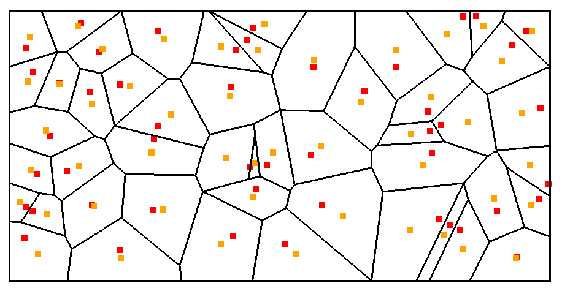
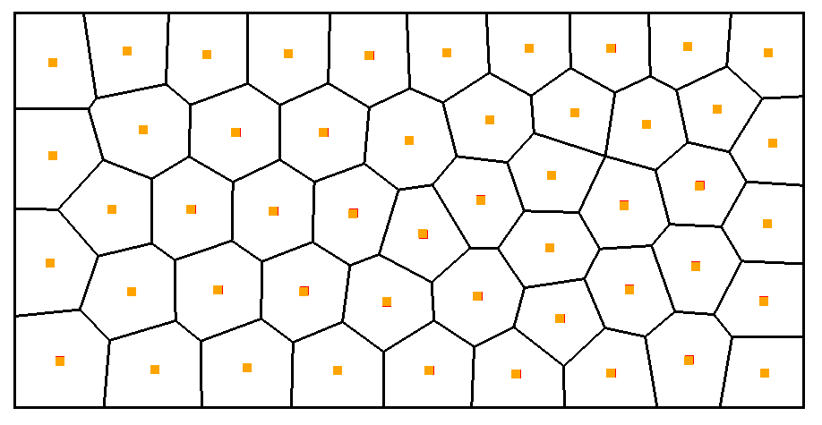
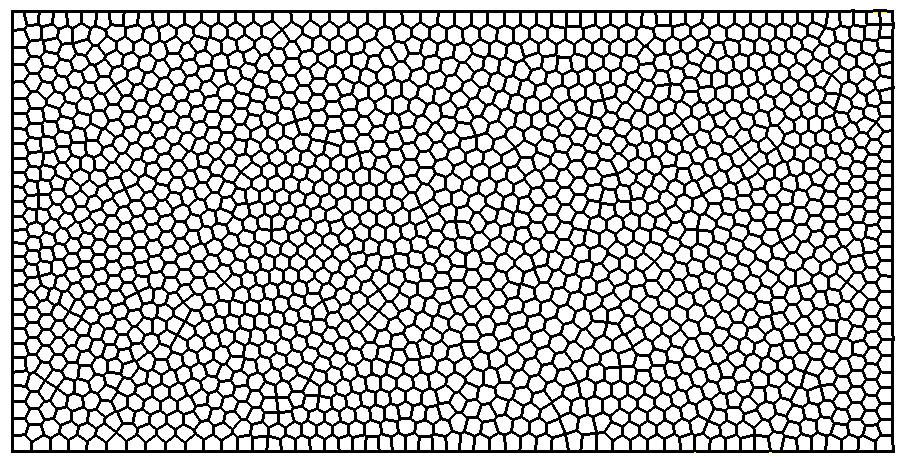
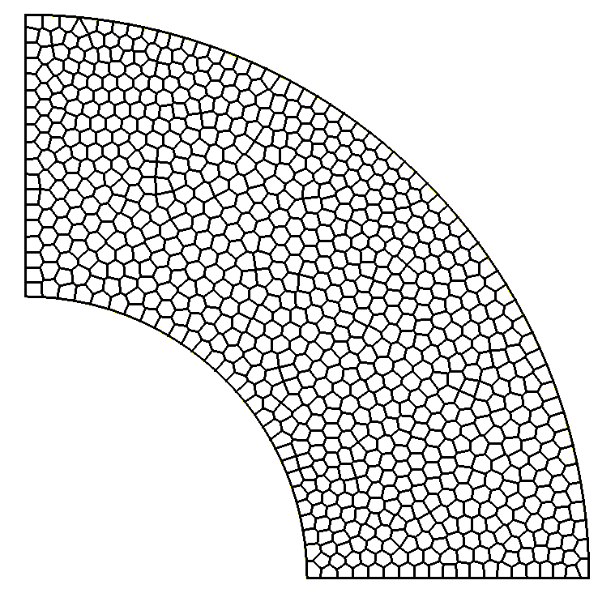
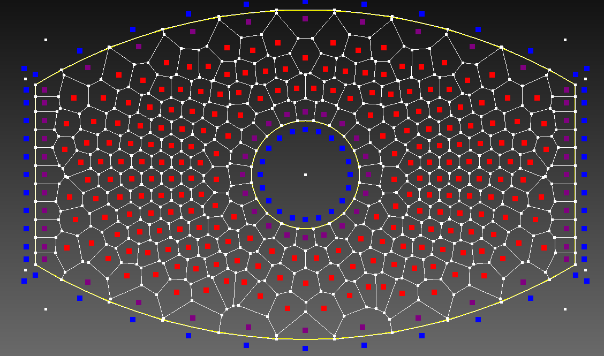
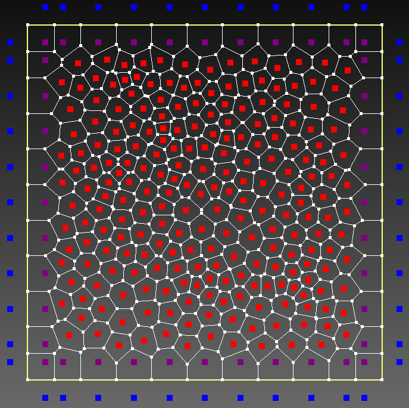

# Polygonal Mesh
This project focuses on building polygonal meshes for finite element method (FEM) and polygonal element modeling in space. The number of elements corresponds to the number of points planted inside the geometric domain.

The boundary geometry is built based on the `NURBS` geometry of the `DEMSoft` library built by my instructor.

The goal of the model is to obtain a list of nodes and manage elements based on the nodes.

Install packages:
```
dotnet add package MathNet.Numerics --version 5.0.0
```
Add References:
```
Project > Add Reference > COM Tab > Matlab Application
```
## Voronoi diagram

Illustrate polygonal elements commonly found in nature




## Generate Polygon and Lloyd's algorithm
The creation of polygonal elements or Voronoi cells is based on the library [Hull-Delaunay-Voronoi](https://github.com/Scrawk/Hull-Delaunay-Voronoi).


 

In which the main implementation function to filter out polygons in the problem domain from randomly planted points is [GenerateVoronoi](https://github.com/Thanh442002/VoronoiMeshForFEA/blob/29f5e425a10c2549837c27a40b05c3c5baef7018/PolygonalMesher.cs#L1103). 



Lloyd's algorithm is applied to improve the mesh :thumbsup:

 

A few mesh images

  

  

## Demo mesh

Go to file [DemoMesh](DemoMesh/Program.cs) to see

